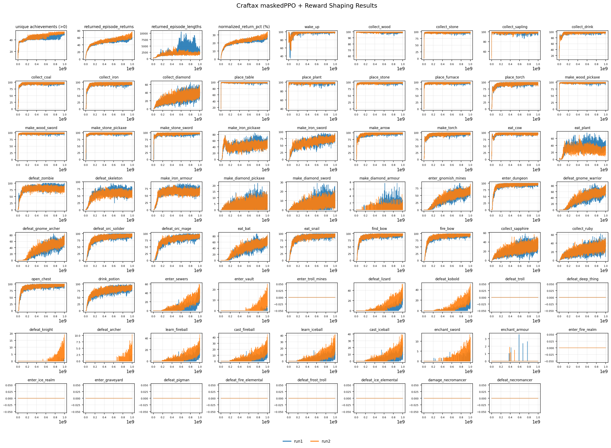

# craftax-maskedPPO-reward-shaping
This repository contains a JAX implementation of a Craftax agent trained with PPO, utilizing invalid action masking and reward shaping.

This project was done under a lab rotation with the objective of improving upon past RL agents in the game of Craftax.

The project relied on the implementation by the user [Reytuag](https://github.com/Reytuag/transformerXL_PPO_JAX) and improved upon his GTrXL model in Craftax.

## Installation
This project uses [uv](https://docs.astral.sh/uv/getting-started/installation/), please make sure you have it installed.
Please check the `pyproject.toml` for any incompatibilities.

After making sure you have uv installed, create a virtual environment and activate it with:
```
uv venv
source .venv/bin/activate
```

Then, install all dependencies with:
```
uv sync
```

## Improvements

### maskedPPO
The agent was trained with PPO + GTrXL with [invalid action masking](https://arxiv.org/abs/2006.14171), masking out various actions every step to reduce the state-action space to explore and improve learning speed.

The masking conditions are provided under `action_mask.md` and `src/modules/environments/action_mask_wrapper.py`.

### Reward Shaping
The reward function was densified from one-time rewards to a wide range of repeated rewards, in addition to [Potential-Based Reward Shaping](https://people.eecs.berkeley.edu/~pabbeel/cs287-fa09/readings/NgHaradaRussell-shaping-ICML1999.pdf) for guiding agent behavior.

The additional rewards can be found under `rewards.md` and `src/modules/environments/reward_shaping_wrapper.py`.

**Opinion Note:** Although changing the reward function takes away from the sparse reward challenge aspect of Craftax, dividing the challenges and solving them in isolation first could result in better experiments.

## Training

Running the training script with:
```
uv run train.py
```
will train the agent with the hyperparameters described in `arguments.py`.

## Results


With a 1-billion-step limit, we achieved a normalized return (%max) of 33.8% in our best training run.

Please be aware that the training has high variance, meaning you could achieve a better or worse score than we did (70 ± 10 `returned_episode_returns`).

Training with the standard hyperparameters in `arguments.py` takes around 8 hours on an RTX 4090 with 24GB VRAM.

Please note that we trained on WSL2, and the JAX documentation mentions that WSL2 support is still experimental.



The `returned_episode_returns` strictly exclude the rewards given through reward shaping.

Training for over 1 billion steps has not been tested yet.